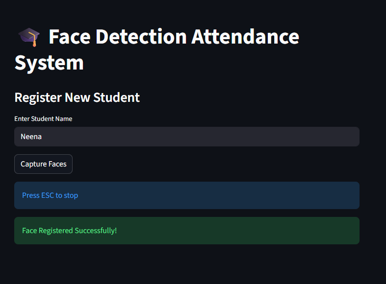
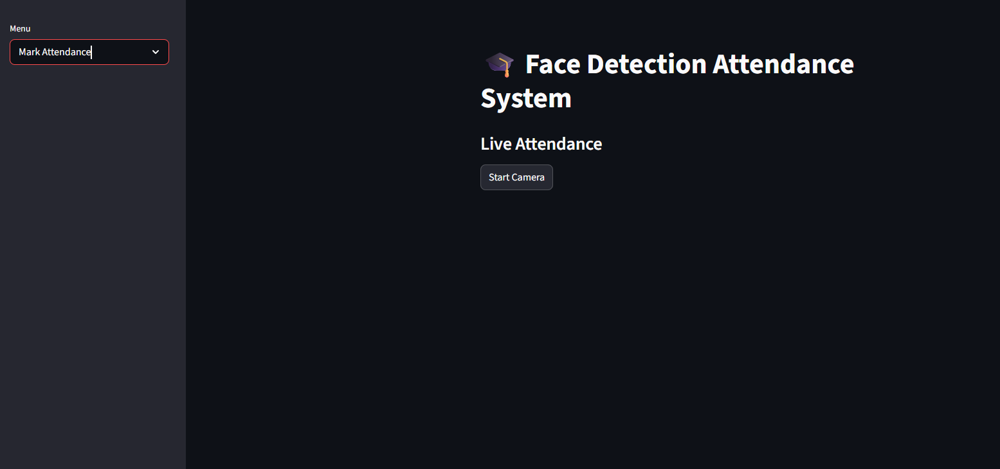

# 🎓 Face Detection Attendance System

## 📌 Description

This project is a Face Detection-Based Attendance System built using Streamlit, OpenCV, and face_recognition. The application captures live video from a webcam, detects and recognizes faces, and automatically marks attendance with name, date, and time.

---

## 🚀 Features

* Face Registration (capture student images)
* Face Recognition using trained model
* Automatic Attendance Marking
* Attendance stored in CSV file
* Duplicate prevention (one entry per day)
* View Attendance Records in Streamlit

---

## 🛠️ Technologies Used

* Python
* OpenCV
* face_recognition
* Streamlit
* Pandas

---

## 📂 Project Structure

face-attendance-system/
├── app.py
├── capture_faces.py
├── train_model.py
├── requirements.txt
├── models/
├── attendance/
├── screenshots/

---

## ▶️ How to Run

1. Install dependencies:
   pip install -r requirements.txt

2. Train model:
   python train_model.py

3. Run app:
   streamlit run app.py

---

## 📊 Output

Attendance is saved in:
attendance/attendance.csv

---

## 📸 Screenshots

### Register Face

### Mark Attendance

### Attendance Records

---

## 📌 Note

The dataset is not included in this repository due to privacy reasons.
Users can register faces and create their own dataset using the application.

---

## 🔗 Conclusion

This system provides an efficient and automated way to mark attendance using face recognition technology.
